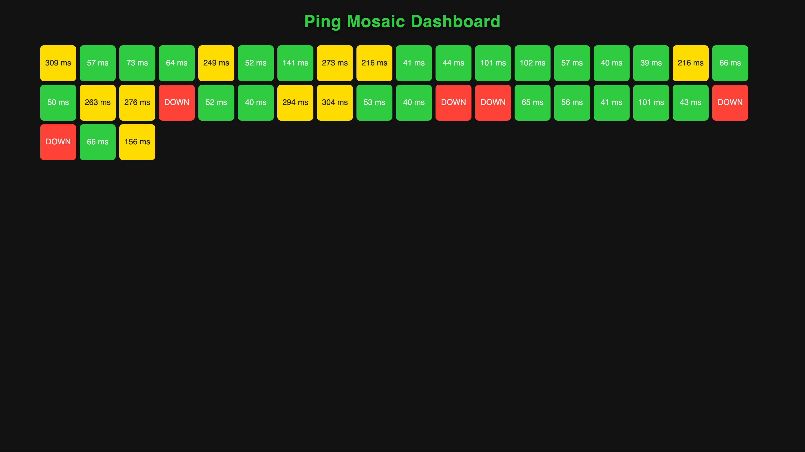

# Mosaic Ping Dashboard

A blazing-fast, real-time network monitoring dashboard written in Go. Mosaic pings hundreds of hosts in parallel and visualizes their status on a web dashboard.



---

## ✨ Features
- **Parallel Pinging:** Continuously pings hundreds of hosts in parallel using raw ICMP (requires NET_RAW capability)
- **Real-Time Web Dashboard:** Mosaic-style grid, each cell shows host status and latency
- **Color Coded:** Green (online), Red (offline), Yellow (slow)
- **Live Tooltips:** Hover over a cell to see the host name
- **Flexible Targets:** Load hosts from a file or CLI
- **Lightweight:** Ultra-minimal Docker image (FROM scratch), single Go binary, no dependencies for frontend

---

## 🚀 Quick Start

### 1. Clone & Build
```bash
git clone https://github.com/PiterPentester/mosaic.git
cd mosaic
go build -o mosaic main.go
```

### 2. Run the Server (requires NET_RAW capability or run as root)
#### 🛡️ Running with NET_RAW (no Docker)

#### Linux
- **Option 1: Use sudo (root, simplest):**
  ```bash
  sudo ./mosaic --hosts=8.8.8.8,1.1.1.1,localhost
  ```
- **Option 2: Grant NET_RAW capability to binary (preferred):**
  ```bash
  sudo setcap cap_net_raw+ep ./mosaic
  ./mosaic --hosts=8.8.8.8,1.1.1.1,localhost
  ```
  ```bash
  ./mosaic --file=hosts.txt
  ```
  (You may need to install setcap: `sudo apt-get install libcap2-bin`)

#### macOS
- macOS does **not** support setcap. You must use sudo/root:
  ```bash
  sudo ./mosaic --hosts=8.8.8.8,1.1.1.1,localhost
  ```
  ```bash
  sudo ./mosaic --file=hosts.txt
  ```

---

## 🐳 Docker Usage

Build the minimal image:
```bash
docker build -t mosaic-ping .
```

Run the container (ICMP requires NET_RAW capability):
```bash
docker run --rm -p 8080:8080 --cap-add=NET_RAW mosaic-ping --hosts=8.8.8.8,1.1.1.1,localhost
```

Or with a hosts file:
```bash
docker run --rm -p 8080:8080 --cap-add=NET_RAW -v $PWD/hosts.txt:/app/hosts.txt mosaic-ping --file=hosts.txt
```

---

## ☸️ Kubernetes Deployment

A simple deployment is provided in `k8s-deployment.yaml`
Modify the image name and ports as needed.
Apply it:
```bash
kubectl apply -f k8s-deployment.yaml
```
Access the dashboard at http://\<node-ip\>:30080

---

## 🖥️ Dashboard UI
- **Grid:** Each tile = one host
- **Color:**
  - 🟩 Green: Host is reachable (fast)
  - 🟨 Yellow: Host is reachable (slow >150ms)
  - 🟥 Red: Host is down
- **Tooltip:** Hover to see the host name
- **Live:** Updates every 2 seconds

---

## ⚙️ Requirements
- Go 1.18+
- OS: macOS, Linux (uses raw ICMP sockets)
- Docker (for containerized usage; image uses FROM scratch)

---

## 📦 Project Structure
```
main.go             # Go backend (ping logic, websocket, server)
dashboard.html      # Web dashboard UI
hosts.txt           # (optional) List of hosts
Dockerfile          # Multi-stage, minimal Docker build
k8s-deployment.yaml # Kubernetes deployment example
README.md           # This file
```

---

## 🛡️ Notes
- Uses [pro-bing](https://github.com/prometheus-community/pro-bing) for raw ICMP pings. Requires NET_RAW capability in Docker/Kubernetes.
- For large host lists, adjust the ping interval or tile size in `dashboard.html` as needed.
- For HTTPS deployments, dashboard auto-selects wss:// or ws:// for WebSocket.

---

## 📄 License
MIT

---

## 🙌 Credits
Created by Windsurf AI under the guidance of Bohdan Pakhomov. PRs and issues welcome!
